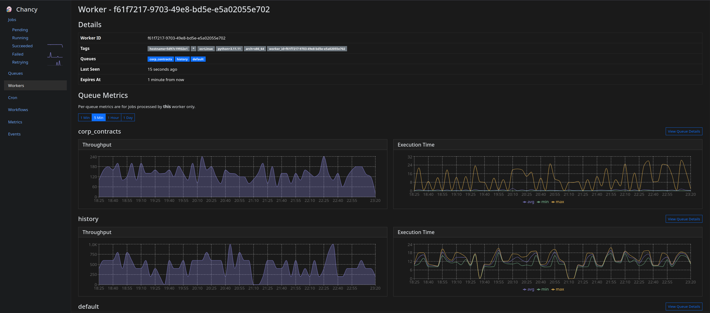

Chancy
======

.. image:: https://img.shields.io/github/license/tktech/chancy
   :alt: MIT License

.. image:: https://img.shields.io/codecov/c/github/TkTech/chancy
   :alt: Codecov

.. image:: https://img.shields.io/pypi/v/chancy
   :alt: PyPI Version

.. image:: https://img.shields.io/pypi/pyversions/chancy
   :alt: Supported Versions

.. image:: https://img.shields.io/badge/os-Linux%20|%20macOS%20|%20Windows-blue
   :alt: OS Platforms

.. image:: https://img.shields.io/badge/postgres-%2014%20|%2015%20|%2016%20|%2017-blue
   :alt: PostgreSQL Versions

Chancy is a distributed task queue and scheduler for Python built on top of
Postgres.

Key Features:
-------------

- **Robust Jobs** - support for priorities, retries, timeouts, scheduling,
  global rate limits, memory limits, global uniqueness, error
  capture, cancellation, and more
- **Minimal dependencies** - Core functionality requires only psycopg3 - which
  can be installed side-by-side with psycopg2.
- **Minimal infrastructure** - No need to run a separate service like
  RabbitMQ or redis. Every feature is built on top of Postgres. No need
  for separate monitoring services like Flower or schedulers like Celery
  Beat - everything is built-in to the worker.
- **Plugins** - Several plugins including a :class:`dashboard<chancy.plugins.api.Api>`,
  :class:`workflows<chancy.plugins.workflow.WorkflowPlugin>`,
  :class:`cron jobs<chancy.plugins.cron.Cron>`, and :doc:`much more <chancy.plugins>`
- **Flexible** - A single worker can handle many queues and mix threads,
  processes, sub-interpreters, and asyncio jobs, allowing powerful workflows
  that use the optimal concurrency model for each job. Queues can be created,
  deleted, modified, and paused at runtime.
- **async-first** - Internals designed from the ground up to be async-first,
  but has minimal sync APIs for easy integration with existing non-async
  codebases.
- **Transactional enqueueing** - Atomically enqueue jobs and the data they
  depend on in a single transaction.
- **Portable** - Supports Linux, OS X, and Windows.
- **100% open & free** - no enterprise tiers or paid features. Checkout
  the repo on `GitHub <https://github.com/tktech/chancy>`_.

Quick Start
-----------

.. tab:: Code

  Install Chancy:

  .. code-block:: bash

     pip install chancy

  Create a new file called ``worker.py``:

  .. code-block:: python
    :caption: worker.py

     import asyncio
     from chancy import Chancy, Worker, Queue, job

     @job()
     def hello_world(*, name: str):
         print(f"Hello, {name}!")

     chancy = Chancy("postgresql://<username>:<password>@<host>/<database_name>")

     async def main():
         async with chancy:
             # Run the database migrations
             await chancy.migrate()
             # Declare the default queue
             await chancy.declare(Queue("default"))
             # Push a job
             await chancy.push(hello_world.job.with_kwargs(name="World"))
             # Start the worker (ctrl+c to exit)
             async with Worker(chancy) as worker:
                 await worker.wait_for_shutdown()

     if __name__ == "__main__":
         asyncio.run(main())

  And now run the worker (ctrl+c to exit):

  .. code-block:: bash

     python worker.py

.. tab:: CLI

  Install Chancy & its CLI:

  .. code-block:: bash

     pip install chancy[cli]

  Create a new file called ``worker.py``:

  .. code-block:: python
     :caption: worker.py

     from chancy import Chancy, job

     @job()
     def hello_world(*, name: str):
         print(f"Hello, {name}!")

     chancy = Chancy("postgresql://localhost/postgres")

  Then run the database migrations:

  .. code-block:: bash

     chancy --app worker.chancy misc migrate

  Declare the default queue:

  .. code-block:: bash

      chancy --app worker.chancy queue declare default

  Push a job:

  .. code-block:: bash

     chancy --app worker.chancy queue push worker.hello_world --kwargs '{"name": "world"}'

  Start a worker:

  .. code-block:: bash

     chancy --app worker.chancy worker start

Congratulations! You've just run your first Chancy job. Next, explore the
:doc:`How To <howto/index>` and :doc:`plugins <chancy.plugins>`. Almost all
features of Chancy are built as plugins for easy customization, so make sure
to check them out to see what else Chancy can do.

Dashboard
---------

Chancy comes with a built-in :class:`dashboard <chancy.plugins.api.Api>` -
no need to run a separate service like Flower. Track your jobs, queues,
workers, and workflows in real-time. Track throughput and completion rates
for each queue, worker, and job type. Monitor the disk space usage of your
Chancy tables and indexes.

.. image:: ../misc/ux_jobs.png
    :alt: Jobs page

.. image:: ../misc/ux_job_failed.png
    :alt: Failed job page

.. image:: ../misc/ux_queue.png
    :alt: Queue page

.. image:: ../misc/ux_workflow.png
    :alt: Worker page

.. toctree::
   :maxdepth: 4
   :caption: Contents:
   :hidden:

   howto/index
   chancy
   design
   faq
   similar

Indices and tables
==================

* :ref:`genindex`
* :ref:`modindex`
* :ref:`search`